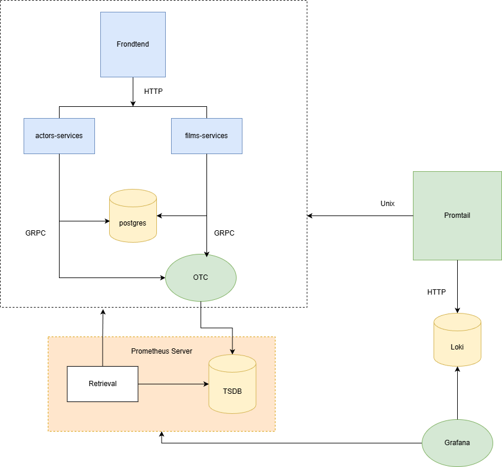

# 🧩 Pagila Microservices Monorepo

This repository contains a complete microservices environment based on the **Pagila** sample database. It includes two Spring Boot microservices, an Angular frontend, database initialization scripts, and a full observability stack.

---

## 📁 Project Structure

```
pagila/
│
├── actors-service/          # Spring Boot microservice for actors CRUD
├── films-service/           # Spring Boot microservice for films CRUD
│
├── frontend/                # Angular frontend served via Nginx
│
├── observability/           # Grafana, Prometheus, Tempo, Loki, Promtail, OTEL Collector
│
├── pagila/                  # SQL schema + demo data for PostgreSQL
│
├── docker-compose.yml       # Runs database + observability + supporting services
├── load-generator.sh        # Script to generate synthetic load
└── .gitignore
```

---

## 🏗️ Architecture Diagram

```

```

---

## 🚀 Running the Environment

From the root folder (`pagila/`):

```bash
docker-compose up -d
```

This launches:

| Component        | Port      | Description      |
| ---------------- | --------- | ---------------- |
| Actors Service   | 8085      | CRUD API         |
| Films Service    | 8086      | CRUD API         |
| Angular Frontend | 80        | UI               |
| PostgreSQL       | 5432      | Pagila DB        |
| pgAdmin          | 5050      | DB admin         |
| Prometheus       | 9090      | Metrics          |
| Grafana          | 3000      | Dashboards       |
| Loki             | 3100      | Logs             |
| Tempo            | 3200      | Traces           |
| OTEL Collector   | 4317/4318 | Telemetry router |

---

## 🧪 Testing APIs

Actors service:

```bash
curl http://localhost:8085/api/v1/actors
```

Films service:

```bash
curl http://localhost:8086/api/v1/films
```

Generate synthetic load:

```bash
./load-generator.sh
```

---

## 📊 Observability

Grafana login:

```
URL: http://localhost:3000
User: admin
Pass: admin
```

Dashboards include:

* API performance (RPS, latency, errors)
* Logs per microservice
* Distributed tracing via Tempo
* Database metrics (if enabled)

---

## 📝 Purpose

This monorepo is designed for:

* Learning microservices architecture
* Practicing observability with OTEL
* Building CI/CD pipelines
* Running local demos with Docker Compose
* Testing distributed tracing and logging

